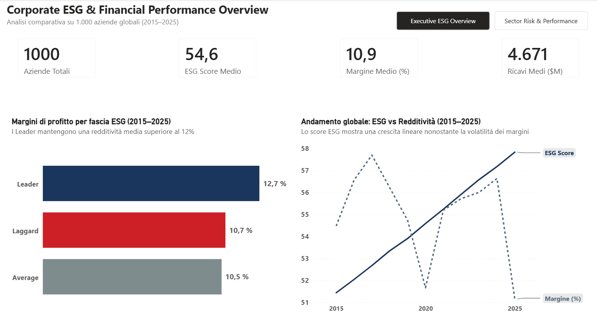
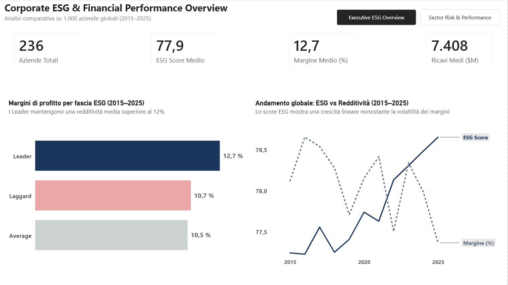
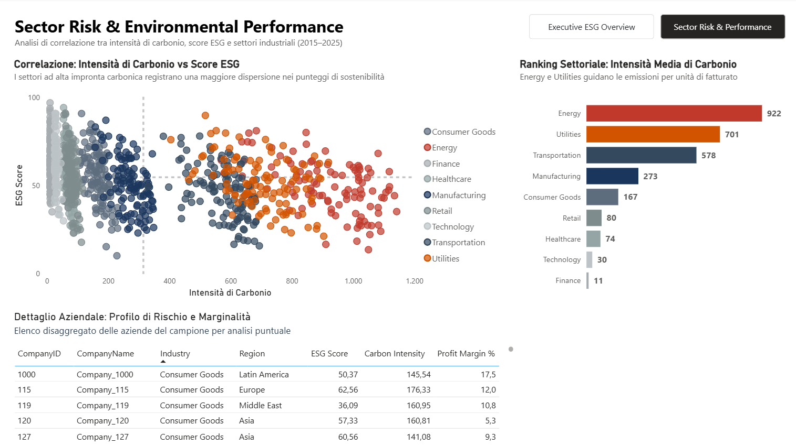
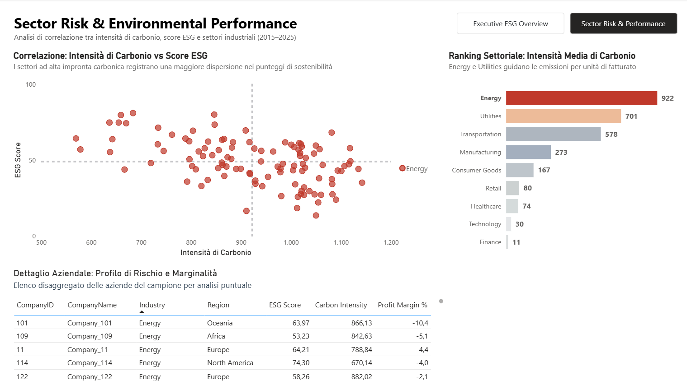
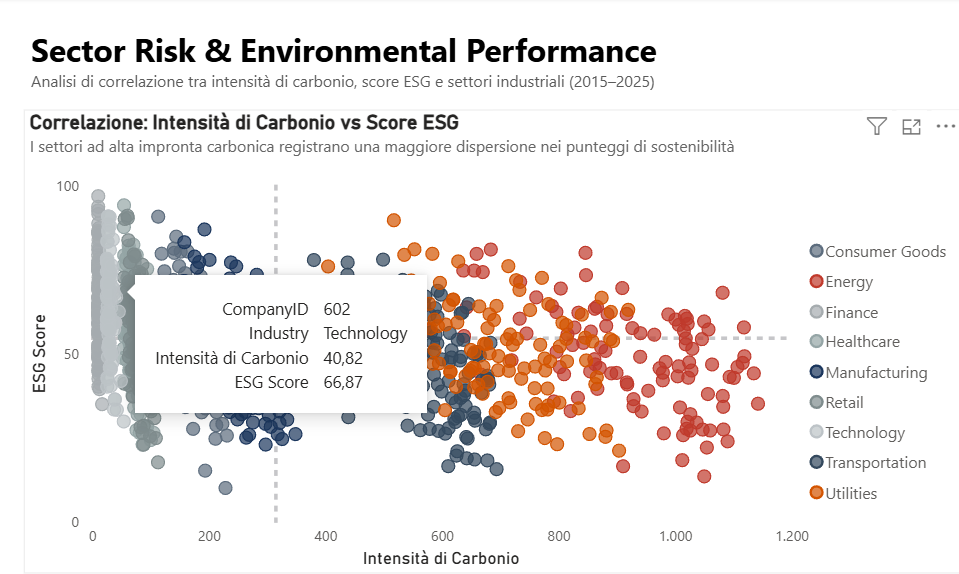

# Corporate ESG & Financial Performance Analysis

> **Quick Links**: [📄 Executive Report (PDF)](Executive_Report.pdf) | [📊 SQL Queries Script](sql/analysis_queries.sql)

## Executive Summary:

Valutare il legame tra le iniziative di sostenibilità aziendale e la resilienza finanziaria è fondamentale per la consulenza strategica e il processo decisionale del top management. Utilizzando Excel, SQL e Power BI, questo progetto analizza un panel di 1.000 aziende globali lungo un arco temporale di 11 anni (11.000 osservazioni) per valutare come la maturità ESG impatti la redditività netta, le dinamiche di crescita e l'efficienza emissiva.

**Key Finding**: L'analisi evidenzia uno spread medio di **+200 bps sui margini operativi** a favore del cluster *Leader* rispetto ai *Laggard* (12,7% vs 10,7%), oltre a una frequenza di esercizi in perdita nettamente inferiore (5,6% vs 8,8%). L'esposizione al rischio emissivo si concentra prevalentemente nei settori *Energy* e *Utilities*, rendendo prioritari interventi di efficienza operativa, conformità alle normative CSRD e accesso a finanziamenti agevolati.

## Business Problem:

I team di Strategy ed ESG Advisory devono fornire al C-level evidenze empiriche per comprendere se gli investimenti in sostenibilità generino ritorni economici tangibili o costituiscano un mero costo di conformità normativa. Le domande di business chiave includono:
1. Le aziende con punteggi ESG elevati (Leader) ottengono margini operativi superiori rispetto a quelle ritardatarie (Laggard)?
2. Quali settori e aree geografiche presentano la maggiore intensità emissiva in rapporto ai ricavi generati?
3. In che misura gli standard ESG impattano sulla frequenza e l'entità degli esercizi in perdita finanziaria?

## Methodology:

### Data Sourcing & Data Integrity

* **Fonte Dati**: Dataset open-source acquisito da **Kaggle** (*ESG & Financial Performance Dataset*), strutturato per simulare serie storiche di corporate sustainability reporting allineate a framework internazionali (MSCI, CSRD, GRI).
* **Perimetro di Analisi**: Panel bilanciato di 1.000 aziende globali tracciate continuativamente lungo l'arco temporale 2015–2025 (11.000 record totali) distribuite su 8 settori industriali e 7 aree geografiche.
* **Audit & Data Quality**:
  * *Verifica di Integrità*: Assenza di valori nulli, duplicati o incongruenze dimensionali validata preventivamente su Google BigQuery (`Query 0`).
  * *Normalizzazione*: Correzione delle formattazioni numeriche/delimitatori e standardizzazione delle serie storiche per garantire consistenza statistica.

---

### 1. Excel (Data Cleaning & Feature Engineering)
Data cleaning, correzione dei formati numerici e dei delimitatori, gestione delle discontinuità storiche (imputazione del valore base GrowthRate 2015 a 0) e feature engineering per il calcolo di Net_Income, Carbon_Intensity ed ESG_Tier.

* **Raw Dataset iniziale:**

  

---

* **Dataset strutturato e pulito:**

  

---

* **Feature Engineering (Net Income, Carbon Intensity, ESG Tier):**

  

---

### 2. SQL & Data Warehouse (Google BigQuery)
Importazione del data warehouse, validazione dell'integrità dei record ed esecuzione delle query analitiche aggregate con segmentazione per cluster ESG, settore industriale, area geografica e serie storica.

#### Query 0: Data Integrity & Audit Validation
Verifica della completezza e consistenza del perimetro di analisi sui 1.000 identificativi aziendali lungo l'orizzonte temporale 2015–2025.

---

#### Query 1: ESG Tier vs. Performance Finanziaria e Rischio di Perdita
Analisi comparativa di marginalità media, crescita del fatturato, utile netto e frequenza percentuale degli esercizi in perdita per ciascun cluster ESG (Leader, Average, Laggard).

---

#### Query 2: Intensità Emissiva ed ESG per Settore e Regione
Valutazione dell'impatto di Carbon Intensity (rapporto emissioni/ricavi) e dello score ESG medio disaggregato per Industry e Region.

---

#### Query 3: Trend Storico Decennale (2015–2025)
Tracciamento dell'evoluzione annuale aggregata dello score ESG medio in relazione alla crescita di ricavi e utile netto.

---

#### Query 4: Benchmark Top 5 Leader Performers
Identificazione delle 5 aziende top di mercato nel cluster Leader che combinano massima redditività percentuale, solidità di utile e controllo delle emissioni.

---

### 3. Power BI Executive Dashboard

#### Page 1: Corporate ESG & Financial Performance Overview
Analisi macro-economica focalizzata su marginalità operativa, volumi di fatturato e correlazione decennale tra maturità ESG e redditività.

| Vista Generale (Tutti i Cluster) | Vista Filtrata (Focus ESG Leader) |
| :---: | :---: |
|  |  |

---

#### Page 2: Sector Risk & Environmental Performance
Valutazione di dispersione tra intensità carbonica e punteggi ESG con cross-filtering dinamico e ispezione puntuale dei dati.

| Vista Generale Settoriale | Dettaglio con Cross-Filtering (Focus Settore Energy) |
| :---: | :---: |
|  |  |

**Ispezione Puntuale (Tooltip Interattivo)**  
Esempio di dettaglio informativo visualizzato al passaggio del cursore sui singoli punti di dispersione:

---

## Skills:
- **Excel**: Data cleaning, normalizzazione formati/delimitatori, formule logiche nidificate, feature engineering, calcolo KPI (Net Income, Carbon Intensity, ESG Tier).
- **SQL (Google BigQuery)**: Data validation, aggregazioni complesse (AVG, COUNT, COUNTIF), conditional formatting con CASE, ranking (ORDER BY, LIMIT) e segmentazione multi-dimensionale.
- **Power BI & Data Visualization**: UI/UX Dashboard Design, Page Navigator nativo, High Data-Ink Ratio, color coding semantico (Navy/Crimson/Gray), cross-filtering bidirezionale.

## Results & Business Recommendations

1. **Premio di Redditività e Resilienza Finanziaria**:
   - **Spread di Marginalità**: I *Leader ESG* generano un margine medio del 12,7% contro il 10,7% dei *Laggard* (+200 bps).
   - **Mitigazione del Rischio di Default**: I Leader presentano una frequenza di esercizi in perdita (5,6%) nettamente inferiore rispetto a Laggard (8,85%) e Average (10,05%), dimostrando che una governance solida funge da cuscinetto protettivo contro la volatilità del mercato.

2. **Matrice dei Rischi Strategici**:
   - **Rischio Ambientale e di Transizione Operativa**: I settori Energy (922 ton/$M) e Utilities (701 ton/$M) concentrano la quasi totalità dell'esposizione emissiva. Senza un piano di decarbonizzazione, sono direttamente esposti all'aumento delle carbon tax e alla perdita di valore degli impianti tradizionali.
   - **Rischio Reputazionale e di Mercato**: La marcata dispersione degli score nei settori B2C (Consumer Goods e Retail) espone le aziende a fondo classifica a danni d'immagine immediati, perdita di contratti con clienti istituzionali attenti ai criteri ESG e accuse di greenwashing.
   - **Rischio Finanziario e di Accesso al Credito**: Le aziende Laggard subiscono tassi di finanziamento più elevati e minore attrattività per i fondi di investimento istituzionali (fondi Articolo 8 e 9 SFDR).

3. **Raccomandazioni Operative per il C-Level**:
   - **Capitale & ESG**: Smettere di considerare i criteri ESG come pura conformità burocratica; adottarli come indicatore predittivo di efficienza economica e gestione del rischio creditizio.
   - **Piani di Mitigazione Mirati**: Istituire task force di audit ambientale prioritariamente sulle controllate dei settori Energy/Utilities con intensità emissiva superiore alla mediana del cluster (>300 ton/$M).

## Next Steps:

### 1. Valutazione Economica dei Rischi e della Conformità
- **Analisi di Sensibilità al Carbon Pricing**: Calcolare l'impatto economico diretto sui margini operativi dei cluster *Energy* e *Utilities* ipotizzando l'introduzione di diversi scaglioni di costo per tonnellata di CO2 emessa.
- **Stress Test sulle Sanzioni Normative (CSRD & Tassonomia UE)**: Stimare l'impatto delle multe pecuniarie previste dalle nuove direttive europee sulle aziende del cluster *Laggard* in caso di mancato adeguamento agli standard di rendicontazione climatica.
- **Piano di Riduzione Emissioni per Settori ad Alto Rischio**: Identificare interventi operativi prioritari per abbassare la Carbon Intensity nei settori *Energy*, *Utilities* e *Transportation*, così da evitare il blocco di gare d'appalto pubbliche e l'esclusione dai requisiti di fornitura per i grandi clienti corporate.

### 2. Piani Operativi per il Ritorno Economico e la Riduzione delle Emissioni
- **Audit di Efficienza Energetica e Autoproduzione (ROI Diretto)**:
  - *Azione*: Installazione di impianti fotovoltaici su tetti industriali, recupero del calore residuo nei processi produttivi e passaggio a sistemi di illuminazione/motori elettrici intelligenti.
  - *Beneficio Economico*: Taglio immediato delle bollette energetiche (riduzione OPEX del 15–25%) e protezione dalla volatilità dei prezzi dei combustibili fossili.
- **Elettrificazione della Flotta e Ottimizzazione Logistica**:
  - *Azione*: Transizione dei veicoli commerciali verso l'elettrico/ibrido e adozione di software per l'ottimizzazione dei percorsi di consegna.
  - *Beneficio Economico*: Minori costi di carburante e manutenzione ordinaria, oltre all'accesso senza restrizioni e senza pedaggi alle zone ZTL e ai centri urbani a basse emissioni.
- **Accesso ai "Green Loans" e Sconto sui Tassi di Interesse**:
  - *Azione*: Presentazione di un piano certificato di riduzione della Carbon Intensity agli istituti bancari.
  - *Beneficio Economico*: Accesso a finanziamenti agevolati (*Sustainability-Linked Loans*) con tassi di interesse scontati (fino a 20–50 bps in meno sul debito aziendale) rispetto ai concorrenti *Laggard*.
- **Economia Circolare e Riduzione degli Sprechi**:
  - *Azione*: Riprogettazione degli imballaggi con materiali riciclati e vendita degli scarti di produzione come materie prime secondarie ad altre aziende.
  - *Beneficio Economico*: Riduzione dei costi di acquisto materiali e abbattimento dei costi vivi di smaltimento rifiuti.
